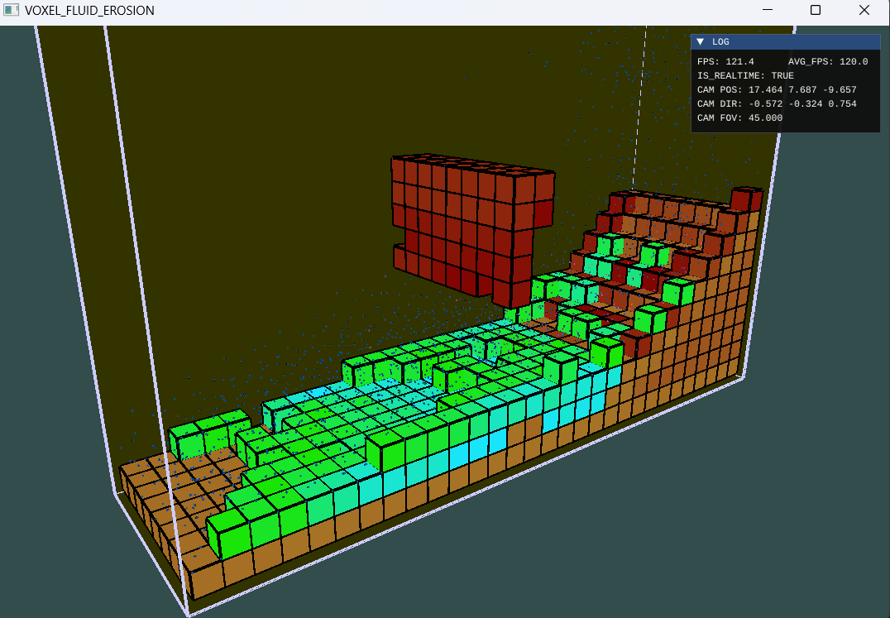

# SPH Voxel Erosion

## What is it

It's a Hydraulic Erosion simulation program using Smoothed Particle Hydrodynamics. I use voxels (like minecraft's cubes) to represent interactive landscapes or solid objects.




## What have I implemented

* SPH particle system in CPU (my particle has many interactions with each other and the environment, it's very hard to implment SPH with complex behavior in GPU)
* 3D-DDA collision detection (check collisions between particles and voxels, I used some naive tricks to make collision result good)
* neighbourhood grid speed up (reduce the particle simulation complexity from O(n^2) to O(n))
* particle erosion (take away mass from solid voxels, will hurt and destroy weak voxels)
* particle diffusion (exchange mass with neighbour particles)
* particle deposition (when particle slows down, it will tend to release its carried mass and re-form solid voxels)

## How to use

This project uses CMake to build and is configured to support MSVC and other compilers under Windows10/11.

To build this project, run the following commands:

```powershell
# MSVC
cmake -S . -Bbuild -DCMAKE_BUILD_TYPE=<Release/Debug>

#  then, open .sln file under ./build directory, and build the project
#  or, you can build using this command
cmake --build build --config <Release/Debug>

# Ninja
cmake -S . -Bbuild-ninja -GNinja -DCMAKE_BUILD_TYPE=<Release/Debug>
cmake --build build-ninja

```

Or you can just open MSVC and it will help you do all the thing **(highly recommend)**


